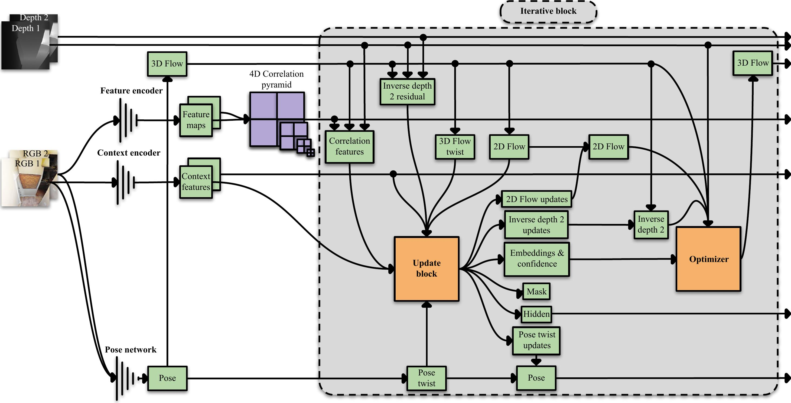

# The Drunkard’s Odometry: Estimating Camera Motion in Deforming Scenes

<p align="center">
  
</p>

<div style="line-height: 0.8;">
<p align="center">The Drunkard’s Odometry: Estimating Camera Motion in Deforming Scenes</p>
<p align="center">David Recasens, Martin R. Oswald, Marc Pollefeys, Javier Civera</p>
<p align="center"><a href="https://arxiv.org/abs/2306.16917">arXiv preprint</a></p>
</div>


## 💭 About
This repository is the official implementation of the Drunkard’s Odometry, a robust flow-based odometry estimation method, and contains information about the Drunkard’s Dataset, a challenging collection of synthetic data targeting visual navigation and reconstruction in deformable environments.


## ⚙️ Setup

We ran our experiments under CUDA 9.1.85, CuDNN 7.6.5 and Ubuntu 18.04 and, using a single RTX Nvidia Titan GPU during training and/or a single RTX Nvidia 2080 Ti for evaluation. We recommend create a virtual environment with Python 3.7 using [Anaconda](https://www.anaconda.com/download/) and install the dependencies as
```shell
conda create -n drunk python=3.7
conda activate drunk
pip install torch==1.7.0+cu101 torchvision==0.8.0+cu101 torchaudio==0.7.0 -f https://download.pytorch.org/whl/torch_stable.html
conda install --file requirements.txt
pip install git+https://github.com/princeton-vl/lietorch.git
```


## 💾 Data

<p align="center">
  <a href="https://youtu.be/wL8JDg6bemg">
    
  </a>
</p>


The Drunkard's Dataset can be found [here](https://drive.google.com/drive/folders/1AZHUKMbe7bR1xwRmAAZ0AHgcEqRnNjms?usp=sharing). Directory structure:
```Shell
├── Drunkard's Dataset
    ├── 1024 (resolution 1024x1024)
        ├── 00000 (scene 0)
            ├── level0 (level of difficulty 0)
                ├── color
                ├── depth
                ├── optical_flow
                ├── normal
                ├── pose.txt 
                ├── wrong_poses.txt (few times)   
            ├── level1 
            ├── level2
            ├── level3
    ├── 320      
```

There are 2 versions of the dataset, with resolution 1024x1024 and 320x320 (this last one being used in this work). For every of the 19 scenes there are 4 levels of deformation difficulty and inside each of them you can find color and depth images, optical flow and normal maps and the camera trajectory.

- Color: RGB uint8 .png images. 
- Depth: uint16 .png grayscale images whose pixel values must be multiplied by (2 ** 16 - 1) * 30 to obtain metric scale in meters.
- Optical flow: .npy image numpy arrays that are .npz compressed. They have two channels: horizontal and vertical pixel translation to go from current frame to the next one.
- Normal: .npy image numpy arrays that are .npz compressed. There are three channels: x, y and z to represent the normal vector to the surface where the pixel falls.
- Camera trajectory pose: .txt file containing at each line a different SE(3) world-to-camera transformation for every frame. Format: timestamp, translation (tx, ty, tz), quaternions (qx, qy, qz, qw).
- Wrong camera poses: .txt file containing corrupted frame timestamps and the immediately adjacent ones that are rejected in the dataloader. It barely happens for some specific cases, not in the used test scenes (0, 4 and 5). It is being currently addressed.

Check the [Drunkard's Odometry dataloader](https://github.com/UZ-SLAMLab/DrunkardsOdometry/blob/b1ce3f57fb0b400a3c47e7f94efb9388cd74ecbb/data_readers/drunkards.py) for further coding technical details to work with the data.


## 🏭 Rendering

Anyone can render custom versions of the Drunkard's Dataset using its [blender project files](https://drive.google.com/drive/folders/1E0DngACgQeVY8bSA-AtBMblegQQU1BDp?usp=sharing). There you can find two blender files per scene and level, one for color and depth images (workspace.blend), and other for optical flow and normal maps (workspace_flow.blend) rendering:
```Shell
├── blender
    ├── 00000 (scene 0)
        ├── level0 (level of difficulty 0)
            ├── workspace.blend (color and depth images)
            ├── workspace_flow.blend (optical flow and normal maps)
        ├── level1 
        ├── level2
        ├── level3
```

You will need to install in Blender [this python script](https://github.com/UZ-SLAMLab/DrunkardsOdometry/blob/b1ce3f57fb0b400a3c47e7f94efb9388cd74ecbb/scripts/render/addon_ground_truth_generation.py) modified from [VisionBlender](https://github.com/Cartucho/vision_blender) (check it out to see the easy installation). 

You can modify the deformations and camera trajectory as you want opening the files in Blender, saving them and executing the following scripts (edit the absolut paths inside them beforehand) to render your custom dataset: 

To render color and depth images:
```shell
sh scripts/render/color_and_depth.sh
```

To render optical flow and normal maps:
```shell
sh scripts/render/flow_and_normal.sh
```

To render camera trajectory:
```shell
sh scripts/render/pose.sh
```


## :call_me_hand: Demo

You can run the demo to predict the camera trajectory from RGB-D frames:

```shell
python scripts/demo.py --name=demo --ckpt=/.../drunkards-odometry.pth --datapath=/.../DrunkardsDatasetSample/00000/level1 --intrinsics 190.68059285 286.02088928 160. 160. --depth_factor=0.000457771 --depth_limit_bottom=0.1 --depth_limit_top=30.
```

In this example, we are estimating the pose on [Drunkard's Dataset samples](https://drive.google.com/file/d/1tKuDIVG_eikSpOAvcvNiS-psIqo-1UJQ/view?usp=sharing) (a 10 frames mini dataset) with the [Drunkard's Odometry model](https://drive.google.com/file/d/1Q7JU8bpmKu6aQqKeoUnYvCp8wJJsUWEp/view?usp=sharing), thus substitute them with your own data and the parameters accordingly. In this demo script, the datapath is the absolut path to the folder where color and depth subfolders are. Execute ```python scripts/demo.py -h``` to see them in detail.


## 🧠 Training

To execute a small training test over [Drunkard's Dataset samples](https://drive.google.com/file/d/1tKuDIVG_eikSpOAvcvNiS-psIqo-1UJQ/view?usp=sharing):

```shell
python scripts/train.py --name=drunkards-odometry-test --datapath=/.../DrunkardsDatasetSample --difficulty_level=1 --batch_size=2 --train_scenes 0 --val_scenes 0 
```

To replicate the paper training you will need to download the Drunkard's Dataset color, depth optical flow and pose with resolution 320x320:

```shell
python scripts/train.py --name=drunkards-odometry --datapath=/.../DrunkardsDataset320 --difficulty_level=1 --depth_augmentor
```

For a personalized training you can play with the different arguments. Execute ```python scripts/train.py -h``` to see them in detail.


## :beers: Drunkard's Dataset Evaluation

To run the used [Drunkard's Odometry model](https://drive.google.com/file/d/1Q7JU8bpmKu6aQqKeoUnYvCp8wJJsUWEp/view?usp=sharing) on all the four levels of difficulty of the Drunkard's Dataset test scenes:

```shell
sh scripts/eval_drunkards_dataset/run_drunkards_odometry.sh
```

You need to modify the arguments to specify your dataset's and model checkpoint's path. By default the evaluations are saved in the folder 'evaluations_drunkards_dataset'. This script outputs the estimated camera poses 'pose_est.txt' and the flow metrics 'metrics.txt'. There are also pose estimation metrics without trajectory alignment, used in the training ablation study.

To obtain the trajectory metrics (RPE traslation, RPE rotation and ATE) you need to execute this script to align the estimated and ground truth trajectories before the evaluation. 

```shell
sh scripts/eval_drunkards_dataset/drunkards_odometry.sh
```

Beforehand, modify the evaluations root path in the script and place the ground truth poses "pose.txt" in the same folder as the estimated ones "pose_est.txt" following this structure:

```Shell
├── evaluations_drunkards_dataset
    ├── 00000
        ├── level0
            ├── drunkards-odometry
                ├── pose.txt
                ├── pose_est.txt                       
```

To evaluate the trajectories of the other baselines (Colmap, DROID-SLAM and Endo-Depth-and-Motion) use the following scripts

```shell
sh scripts/eval_drunkards_dataset/colmap.sh
sh scripts/eval_drunkards_dataset/droidslam.sh
sh scripts/eval_drunkards_dataset/edam.sh
```

You need to save the estimated poses 'pose_est.txt' with the same folder structure as the Drunkard's Odometry, but name the method's folder as 'colmap', 'droidslam' or 'edam', respectively. In addition, in those cases where not the full scene has been tracked, you must remove those missing poses from the ground truth file 'pose.txt'.

## :man_health_worker: Hamlyn Evaluation

As the Hamlyn dataset does not have ground truth camera poses, to evaluate the trajectory estimation we introduce ground truth-free metric Absolut Palindrome Trajectory Error (APTE), that averages the L2 error between start and end pose of the estimated trajectory for the palindrome video (k-frames forward and backward) over all possible loop lengths. Therefore, this metric needs the forward and backward estimated trajectories.
For the evaluation, we use the same [data](https://drive.google.com/file/d/1Iqdk8P51FuD5O96mO_8YubyKQ6BzQRp9/view?usp=sharing) as in the tracking experiments of the paper [Endo-Depth-and-Motion](https://ieeexplore.ieee.org/abstract/document/9478277?casa_token=jo2SHKzVwd8AAAAA:EEsxN4CvnZr8BcASDFF5GdXIqVX7cWGiYUIyhuQ19iz4GF7vsK1f-GkfHRhsh0hmEtdb__aVDg), that consists in forward and backward RGB images of test scenes 1 and 17 with the black borders cropped out and the estimated depth maps by a single-view self-supervised network with the following structure:

```Shell
├── HamlynData
    ├── test1 (forward)
        ├── color
        ├── depth
        ├── intrinsics.txt
        ├── intrinsics_matrix.txt     
    ├── test1_backward                  
```

To run the used Drunkard's Odometry models that were trained [with](https://drive.google.com/file/d/1F6rTZAZmlNqYeyjt8mv5vye4ZuY7RbHr/view?usp=sharing) and [without](https://drive.google.com/file/d/16PGUjc_o0lbcgC6LAt6V-A7AhzFqNqdn/view?usp=sharing) deformation:

```shell
sh scripts/eval_hamlyn/drunkards_odometry.sh
```

To invert the numbering of the color and depth images of the scenes you can leverage the script ```scripts/eval_hamlyn/invert_order_images.py```. Once you have the forward and backward trajectories of the scenes, use ```scripts/eval_hamlyn/join_two_trajectories``` to join them in a single total trajectory. Then, obtain the Sim(3) scale alignment to equate the scale of all trajectories with ```scripts/eval_hamlyn/get_scale_alignment.sh``` (take the printed "scale correction" value). Particularly, in this work we use as reference the trajectory of Endo-Depth-and-Motion (EDaM). After this, to compute the APTE of all the methods, introduce these scale factors in ```scripts/eval_apte.py``` and execute it.

## ‍🎓 Citing

```shell
@article{recasens2023drunkard,
  title={The Drunkard's Odometry: Estimating Camera Motion in Deforming Scenes},
  author={Recasens, David and Oswald, Martin R and Pollefeys, Marc and Civera, Javier},
  journal={arXiv preprint arXiv:2306.16917},
  year={2023}
}
```


## 👩‍⚖️ License

The code, dataset and additional resources of this work are released under [MIT License](LICENSE). There are some parts of the code modified from other repositories subject also to their own license:

- The code in drunkards_odometry and data_readers folders is based and extended from [RAFT-3D](https://github.com/princeton-vl/RAFT-3D) under [BSD 3-Clause License](https://github.com/princeton-vl/RAFT-3D/blob/master/LICENSE).
- The code in drunkards_odometry/pose_cnn is derived from [Manydepth](https://github.com/nianticlabs/manydepth) under [ManyDepth License](https://github.com/nianticlabs/manydepth/blob/master/LICENSE).


## 🔬 Funding

This work was supported by the EU Comission (EU-H2020 EndoMapper GA 863146), the Spanish Government (PID2021-127685NB-I00 and TED2021-131150BI00), the Aragon Government (DGA-T45 17R/FSE), and a research grant from FIFA.
